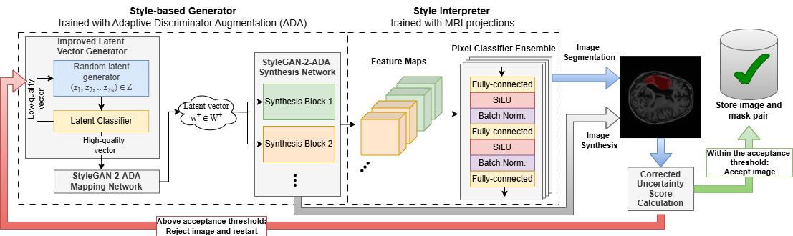
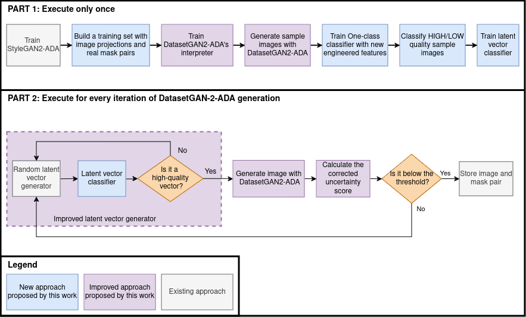

# DatasetGAN2-ADA

Paper supporting the code: **Enhanced Deep Style Interpreter for Automatic Synthesis of Annotated Medical Images**



## 1. How does it work?


## 2. Requirements

- Python 3.8 is supported.

- Pytorch >= 1.4.0.

- The code is tested with CUDA 10.1 toolkit with Pytorch==1.4.0 and CUDA 11.4  with Pytorch==1.10.0.

- All results in our paper are based on NVIDIA Tesla V100 GPUs with 32GB memory. 

- Set up python environment:
```
virtualenv env
source env/bin/activate
pip install -r requirements.txt
```
- Add the project to PYTHONPATH:
```
export PYTHONPATH=$PWD
```


## 3. Creating execution environment
<span style="color:red">Detailed instructions will be added soon.</span>

## 4. Download datasets
For convinience, we provide the preprocessed ATLAS 2.0 image inferior-superior layers used in the experiments, the projected images and latents, and the synthetic images generated by DatasetGAN2-ADA.

Create a folder ``datasets/`` inside the project and extract the following files inside the folders:
 Folder Name  | Link | Description |
|---------|--------------|----------------|
|ATLAS_2_0_processed|[link](https://drive.google.com/file/d/1ycESBudCnKuFeL2w-k4q4Ezw9uA8WXjc/view?usp=sharing)| ATLAS 2.0 preprocessed layers (train folder) and synthetic images generated by DatasetGAN2-ADA (test folder) without filtering low US score and anomalies.|
|synthetic_ATLAS_2_0_layers|[link](https://drive.google.com/file/d/1AOdoqBogDpcz1mSEEW11sInOVByUURYx/view?usp=sharing)|Metadata, masks and additional info generated by DatasetGAN that are not inside `ATLAS_2_0_processed/class_80_100/test`.|
|result_images| [link](https://drive.google.com/file/d/1L-KJIhGb5s8XJR52PGpjVOzu2FH3EEZI/view?usp=sharing) |Result images obtained at the end of the experiment. Refer to Tab 4 for the nomenclature.|


After downloading and adding all the folders, run the following commands to populate synthetic_ATLAS_2_0_layers:
```
cp ./datasets/ATLAS_2_0_processed/class_80_100/test/*.tiff ./datasets/synthetic_ATLAS_2_0_layers/synthetic_with_metadata/
```

## 5. Reproduce the experiments 

### 5.1. Only the results and plots with the provided preprocessed and synthesized images

1 - Download the image datasets following the instructions above

2 - Execute the jupyter notebook `Article_experiments.ipynb`

### 5.2. Run all the experiments

1 - Train StyleGAN2-ADA with `processed_ATLAS_2_0_layers` images. Be aware that rerunning the training of StyleGAN2-ADA might produce different results. We share the StyleGAN2-ADA checkpoint for convenience: <span style="color:red">PENDING</span>

2 - Generate projections of a few training images. We share the image projections along with their latentes and original masks for convenience: <span style="color:red">PENDING</span>

 <!--TODO: provide instructions to generate image projections-->

3 - Select a few projections and use them along with original masks to Train DatasetGAN2-ADA's interpreter. We share the DatasetGAN2-ADA checkpoint for convenience:

4 - Generate Synthetic images and masks with DatasetGAN2-ADA.

5 - Execute the jupyter notebook `Article_experiments.ipynb`

## 6. Run experiments with your own dataset

You can use DatasetGAN2-ADA on your own dataset by reproducing the item `5.2.` on your dataset. DatasetGAN2-ADA was originally prepared for grayscale MRI. Thus, a few minor adjustments should be done to make it compatible with RGB images.


## Citations

Please use the following citation if you use our data or code:

<span style="color:red">PENDING</span>

<!-- ## License

PENDING

##### License Dependencies

For any code dependencies related to StyleGAN2, the license is the  Nvidia Source Code License-NC by NVIDIA Corporation, see [StyleGAN2 LICENSE](https://nvlabs.github.io/stylegan2/license.html).

For any code dependencies related to DatasetGAN, the license is the MIT License, see [DatasetGAN LICENSE](https://github.com/nv-tlabs/datasetGAN_release/blob/master/LICENSE.txt).

The dataset of DatasetGAN is released under the [Creative Commons BY-NC 4.0](https://creativecommons.org/licenses/by-nc/4.0/) license by NVIDIA Corporation.

For any code dependencies related to the frontend tool (including html, css and Javascript), the license is the Nvidia Source Code License-NC. To view a copy of this license, visit [./static/LICENSE.md](./static/LICENSE.md). To view a copy of terms of usage, visit [./static/term.txt](./static/term.txt). -->

